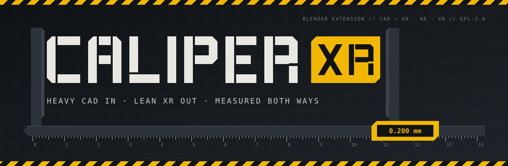
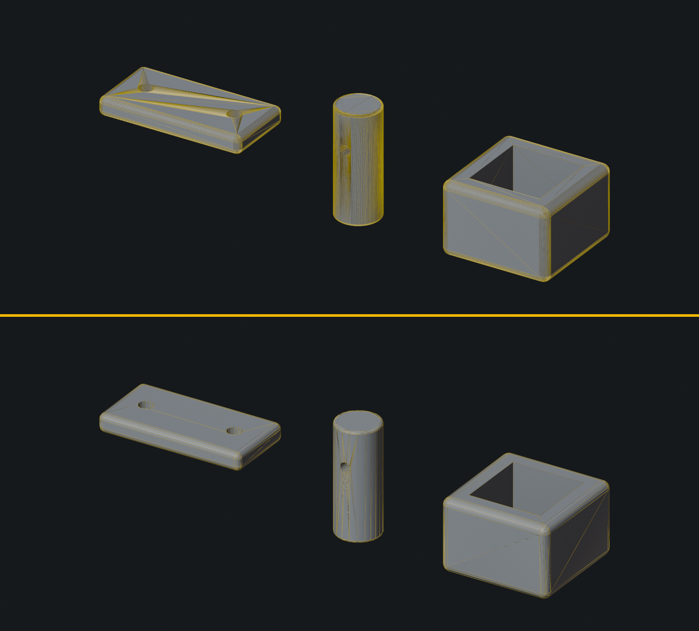
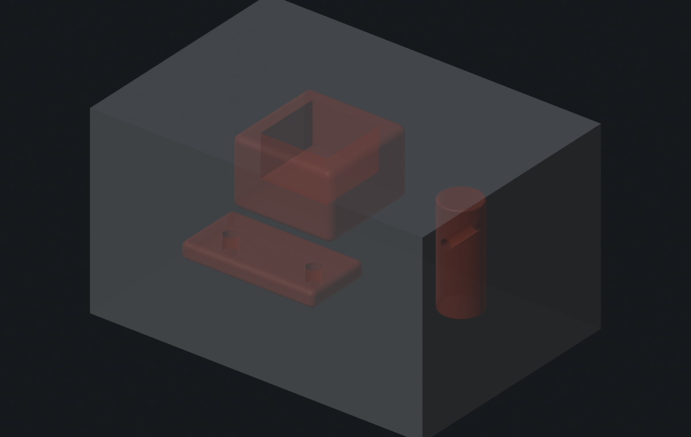

<p align="center">
  
</p>

<p align="center">
  
  
  
  
  
</p>

**Caliper XR** is a Blender extension that rebuilds tessellated CAD for VR, AR and XR. Every part
comes out lighter, and never farther than the tolerance from the original surface - measured in
both directions, in double precision, before anything ships. Hidden geometry is removed, the
outer shell can be isolated, and the original CAD is never touched.

```
  CAD TESSELLATION ──▶ RECOVER CAD FACES ──▶ REBUILD LEAN ──▶ MEASURE BOTH WAYS ──▶ GLB
     331,700 tris        planes · fillets       on the surface     ≤ 0.200 mm          54,979 tris
```

---

## `01` &nbsp;SPEC SHEET

| | |
|---|---|
| **Input** | Tessellated CAD in Blender - STEP, SolidWorks, glTF or FBX imports; one part or an assembly of hundreds |
| **Output** | Lean meshes in a `REBUILT` collection, named `<part>_REBUILT`; GLB export with Draco |
| **Tolerance classes** | `HIGH 0.1 mm` · `BALANCED 0.2 mm` · `LIGHT 0.5 mm` · custom |
| **Guarantee** | Two-way: every CAD point within tolerance of the result, every result face within tolerance of the CAD. A part that misses it is flagged, and export refuses it |
| **Topology** | CAD-style - n-gons on flat faces, quads on strips, crisp edges where the CAD has them, cut-outs kept; the CAD's own normals, UVs and materials |
| **Hidden geometry** | GPU visibility from 128 directions around the selection |
| **Outer shell** | Voxel reachability - inner bodies, closed cavities, faces between touching bodies and whatever sits behind a seam narrower than a set gap |
| **Source CAD** | Read-only. Never edited, moved, decimated or deleted |
| **Requires** | Blender 4.2 LTS or newer - developed and tested on 5.2 |

## `02` &nbsp;FIELD RESULTS

<p align="center"></p>

*Above: the CAD tessellation, 6,964 triangles. Below: Caliper XR at 0.2 mm, 1,254 triangles - the
same parts, within 0.2 mm both ways.*

| Part | CAD | Caliper XR | Reduction | Largest deviation |
|---|---:|---:|---:|---:|
| Filleted bracket, two bores | 1,492 | 442 | **3.4×** | 0.180 mm |
| Chamfered shaft, 6 mm cross bore | 4,000 | 424 | **9.4×** | 0.182 mm |
| Pocketed housing | 1,472 | 388 | **3.8×** | 0.197 mm |
| Sheet-metal cabinet assembly, 820 parts | 331,700 | 54,979 | **6.0×** | 0.200 mm |
| ↳ same, *Outer shell only*, 25 mm gap | 331,700 | 35,024 | **9.5×** | 0.200 mm |

The three test parts are built by [`tests/harness.py`](tests/harness.py) - rerun them with
`tools/test.sh`. The assembly figures come from a production job whose CAD cannot ship here.

## `03` &nbsp;INSTALL

1. Download **`caliper_xr-1.0.0.zip`** from [Releases](../../releases/latest).
2. In Blender: **Edit ▸ Preferences ▸ Get Extensions**, open the **⌄** menu at the top right,
   choose **Install from Disk…** and pick the zip. Dragging the zip into Blender works too.
3. The **Caliper** tab appears in the 3D Viewport sidebar (`N`).

## `04` &nbsp;OPERATING PROCEDURE

1. **Import the CAD at its real scale.** Caliper reads millimetres from the scene's unit scale
   and each object's scale.
2. **Select the parts** - a single part or a whole assembly.
3. **Caliper ▸ Quality** - pick a tolerance class.
4. *Optional:* **Check Shell** - see what would be left out before anything is built.
5. **Retessellate for XR.** Rebuilds land in `REBUILT`; the report opens as `Caliper_Report`
   in the Text Editor.
6. **Verify** and **Audit** - re-measure, and list anything to redo.
7. **Export XR GLB** - refuses unverified or out-of-tolerance parts unless told otherwise.

The full manual - every control, every report line, troubleshooting - is
**[docs/GUIDE.md](docs/GUIDE.md)**.

## `05` &nbsp;CONTROLS

| Control | Default | Effect |
|---|---|---|
| **Quality** | Balanced · 0.2 mm | The two-way tolerance. *High* 0.1 mm for close-up inspection, *Light* 0.5 mm for room-scale scenes and mobile headsets, *Custom* for any value |
| **Crease angle** | 30° | Edges sharper than this always stay crisp, even where the CAD's normals are smooth |
| **Remove hidden geometry** | on | Drop CAD faces no camera sees from 128 directions around the selection |
| **Outer shell only** | off | Also drop every face inside the outer skin |
| **Seal gaps under** | 2 mm | Openings narrower than this do not count as a way in |
| **Shell of** | Whole selection | One skin around the selection, or *Each part* keeping its complete skin (for parts that move in XR) |
| **Keep materials** | on | Carry each part's materials onto its rebuild |

## `06` &nbsp;HOW IT MEASURES

1. **Recover the CAD faces.** A tessellation still carries its B-rep: exporter splits, custom
   normals, UV seams, material changes and creases mark where one CAD face ends. Flat regions
   are extracted as planes.
2. **Flatten every face** - by its plane, a whole-face unwrap, or a projection - so it can be
   triangulated in 2D.
3. **Simplify the outline network** once, globally, so neighbouring faces share every vertex -
   and no shortcut may leave the CAD surface.
4. **Rebuild each face lean**: a constrained Delaunay triangulation of its outline, refined only
   where the result strays - with source vertices, or points placed exactly on the source
   surface. A face never comes out heavier than its source.
5. **Measure both ways** - every CAD vertex and face centre against the result, every result face
   centre and edge midpoint against the CAD. Anything over tolerance gets its outline restored,
   then its exact source triangles back.
6. **Assemble** n-gons on planes and quads on strips, with the CAD's normals and UVs, split
   along the diagonal that was measured.

Distances are **exact**. Blender's BVH computes closest points in single precision, and on the
long thin triangles sheet metal is made of it misjudges them by up to 0.67 mm - an exact copy of
a part read as out of tolerance. Caliper uses the BVH only to find candidates, and measures in
double precision ([`caliper_xr/nearest.py`](caliper_xr/nearest.py)).

<p align="center"></p>

*Check Shell on a sealed enclosure: the parts inside, in red, are what **Outer shell only** leaves out.*

## `07` &nbsp;INSPECTION REPORT

Every run writes a report - here, the three test parts at 0.2 mm:

```text
# CAD -> XR  2026-09-26 23:19  tolerance 0.200 mm, 3 part(s)
  visibility: GPU, 128 views of 3 parts, 2.1s
== bracket -> bracket_REBUILT: 1492 -> 442 triangles
  source 1492 triangles; 3 CAD faces recovered
  largest deviation 0.180 mm (tolerance 0.200): CAD to XR 0.180, XR to CAD 0.172
  6 flat faces, 1 curved faces unwrapped whole, 8 projection pieces
  rebuilt 15 pieces in 0.2s
== shaft -> shaft_REBUILT: 4000 -> 424 triangles
  source 4000 triangles; 10 CAD faces recovered
  largest deviation 0.182 mm (tolerance 0.200): CAD to XR 0.180, XR to CAD 0.182
  22 flat faces, 10 curved faces unwrapped whole, 4 projection pieces
  rebuilt 36 pieces in 0.9s
== housing -> housing_REBUILT: 1472 -> 388 triangles
  source 1472 triangles; 6 CAD faces recovered
  largest deviation 0.197 mm (tolerance 0.200): CAD to XR 0.197, XR to CAD 0.195
  11 flat faces, 1 curved faces unwrapped whole, 0 projection pieces
  rebuilt 12 pieces in 0.3s
  TOTAL 6964 -> 1254 triangles (x5.6), 0 hidden part(s) skipped, 0 failed, 4s
```

## `08` &nbsp;SAFETY RULES

> [!IMPORTANT]
> - **The source CAD is read-only.** Rebuilds are new objects in `REBUILT`; the originals are
>   never edited, moved, decimated or deleted.
> - **Every vertex lies on the CAD surface.** No decimation, no smoothing, no averaging.
> - **The tolerance is a hard limit, both ways.** A part that misses it says so in the report and
>   on its panel, and the exporter refuses it.
> - **Nothing is left out of sight silently.** Check Shell shows what the hidden and shell tests
>   drop, before a build.

## `09` &nbsp;KNOWN LIMITS

- **The shell grid is resolution-bound.** A large assembly cannot be voxelised finer than about
  1/640 of its size, so on a 1.6 m cabinet a 2 mm gap setting seals openings up to about 5.6 mm.
  The report always states the real figure.
- **A sealed opening shows emptiness at close range.** What sits behind a seam or vent narrower
  than the gap is removed, so looking straight into it shows through.
- **Reachability is all-or-nothing per cavity.** One opening wider than the gap makes a whole
  interior count as outside. What is merely out of sight in there is the camera test's job.
- **Each part** mode judges parts separately, but *Remove hidden geometry* always judges the
  whole selection - turn it off when parts must stay complete.

## `10` &nbsp;BUILD & TEST

```bash
tools/test.sh                      # 4 headless suites, 55 checks, about 20 s
tools/build.sh                     # validate and build dist/caliper_xr-1.0.0.zip
BLENDER=/path/to/blender tools/test.sh
blender -b --factory-startup --python tools/render_docs.py   # regenerate the images above
```

| Suite | Checks |
|---|---|
| [`test_addon.py`](tests/test_addon.py) | The operators end to end - Check Shell, Retessellate, Verify, Audit, GLB export, Housekeeping - the CAD untouched, a closed part still closed |
| [`test_retess.py`](tests/test_retess.py) | Three CAD-like parts at 0.2 and 0.1 mm: lighter, within tolerance by the engine and by Verify |
| [`test_shell.py`](tests/test_shell.py) | Sealed box, 1 mm slit, touching blocks, a 5 × 40 mm drilled hole |
| [`test_nearest.py`](tests/test_nearest.py) | Exact distance on 600-900 mm sheet-metal strips against a brute force |

---

<sub>**CALIPER XR** · GPL-3.0-or-later, as Blender add-ons require · maintained by Techcopter</sub>
